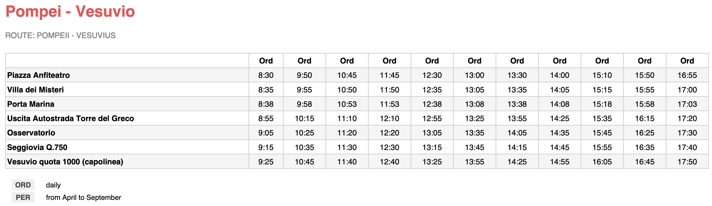

# Napoli

In tropical cities you never ever forget the speaker.

Napoli is a vibrant and bustling city located on the beautiful Bay of Naples in southern Italy.

It is the capital of the Campania region and is known for its rich history, culture and cuisine.
The city is also known for its vibrant nightlife, with a variety of bars, clubs, and restaurants to explore.

Napoli is a great destination for those looking to experience the best of Italian culture and cuisine.

## Itinerary

### 2023-06-01

| Time | Activity |
| --- | --- |
| 6:15  | [Departure](https://github.com/falcucci/notes/files/11615748/C9FNYC.pdf)  |
| 11:00 | [Arrival](https://github.com/falcucci/notes/files/11615757/LJ5FUE.pdf)  |
| 12:00 | Have lunch in the old town |
| 15:00 | [Visit the Royal Palace of Naples](https://maps.apple.com/?address=Piazza%20del%20Plebiscito%201,%2080132%20Naples,%20Italy&auid=1115088372178881518&ll=40.836252,14.249549&lsp=9902&q=Royal%20Palace%20of%20Naples) |
| 18:00 | Explore the city (google for interesting things to do) |
| 20:00 | Enjoy a pizza dinner in the old town ( or try to stay close to the sea if possible) |
| 23:00 | sleep. |

## 2023-06-02

| Time | Activity |
| --- | --- |
| 9:30 | [Herculaneum-ticket.pdf](https://github.com/falcucci/notes/files/11614949/Herculaneum-ticket.pdf) |
| 13:00 | Lunch (random place in napoli, google it.) TODO |
| 14:00 | Decide if we try to go to Pompeii after lunch |
| 15:00 | (pompeii or sea. Find out when is the last boat to come back from capri) TODO |

## 2023-06-03

| Time | Activity |
| --- | --- |
| 8:30 | [take the bus](https://github.com/falcucci/notes/files/11615229/Timetable.Pompei.-.Vesuvio.pdf)  |
| 9:10 | [Vesuvius ticket.pdf](https://github.com/falcucci/notes/files/11614975/Vesuvius.ticket.pdf) |

## 2023-06-04

# CAPRI

- Visit the Blue Grotto: [Google Maps Location](https://goo.gl/maps/XF6X3XK6XG2X1zVF9)
- Take a Boat Tour: [Google Maps Location](https://goo.gl/maps/XF6X3XK6XG2X1zVF9)
- Explore the Gardens of Augustus: [Google Maps Location](https://goo.gl/maps/XF6X3XK6XG2X1zVF9)
- Visit the Faraglioni Rocks: [Google Maps Location](https://goo.gl/maps/XF6X3XK6XG2X1zVF9)
- Take a Hike: [Google Maps Location](https://goo.gl/maps/XF6X3XK6XG2X1zVF9)
- Visit the Villa San Michele: [Google Maps Location](https://goo.gl/maps/XF6X3XK6XG2X1zVF9)
- Take a Tour of the Island: [Google Maps Location](https://goo.gl/maps/XF6X3XK6XG2X1zVF9)
- Shop in the Piazzetta: [Google Maps Location](https://goo.gl/maps/XF6X3XK6XG2X1zVF9)
- Visit the Certosa di San Giacomo: [Google Maps Location](https://goo.gl/maps/XF6X3XK6XG2X1zVF9)
- Enjoy the Beaches: [Google Maps Location](https://goo.gl/maps/XF6X3XK6XG2X1zVF9)

After a heavy and long hike we will enjoy a relaxing day in Capri.

random places to visit
|------|
| [Castel dell'Ovo](https://en.wikipedia.org/wiki/Castel_dell%27Ovo)  |
| [National Archaeological Museum](https://en.wikipedia.org/wiki/National_Archaeological_Museum,_Naples)  |
| [Piazza del Plebiscito](https://en.wikipedia.org/wiki/Piazza_del_Plebiscito)  |
| [San Carlo Theatre](https://en.wikipedia.org/wiki/Teatro_di_San_Carlo)  |
| [Royal Palace of Naples](https://en.wikipedia.org/wiki/Royal_Palace_of_Naples)  |
| [Santa Chiara Church](https://en.wikipedia.org/wiki/Santa_Chiara,_Naples)  |
| [Catacombs of San Gennaro](https://en.wikipedia.org/wiki/Catacombs_of_San_Gennaro)  |
| [Piazza del Gesù Nuovo](https://en.wikipedia.org/wiki/Piazza_del_Ges%C3%B9_Nuovo)  |
| [Galleria Umberto I](https://en.wikipedia.org/wiki/Galleria_Umberto_I)  |
| [Maschio Angioino](https://en.wikipedia.org/wiki/Castel_Nuovo)  |
| [Piazza del Gesù](https://en.wikipedia.org/wiki/Piazza_del_Ges%C3%B9)  |
| [Certosa di San Martino](https://en.wikipedia.org/wiki/Certosa_di_San_Martino)  |
| [Catacombs of San Gaudioso](https://en.wikipedia.org/wiki/Catacombs_of_San_Gaudioso)  |
| [Castel Sant'Elmo](https://en.wikipedia.org/wiki/Castel_Sant%27Elmo)  |
| [San Gregorio Armeno](https://en.wikipedia.org/wiki/San_Gregorio_Armeno)  |
| [Piazza del Plebiscito](https://en.wikipedia.org/wiki/Piazza_del_Plebiscito)  |
| [Piazza del Municipio](https://en.wikipedia.org/wiki/Piazza_del_Municipio)|
| [Castel Nuovo](https://en.wikipedia.org/wiki/Castel_Nuovo) |
| [Teatro di San Carlo](https://en.wikipedia.org/wiki/Teatro_di_San_Carlo) |
| [Museo di Capodimonte](https://en.wikipedia.org/wiki/Museo_di_Capodimonte) |

# Sorrento

- Visit the [Marina Grande](https://en.wikipedia.org/wiki/Marina_Grande)
- Take a boat tour of the [Amalfi Coast](https://en.wikipedia.org/wiki/Amalfi_Coast)
- Explore the historic center of [Sorrento](https://en.wikipedia.org/wiki/Sorrento)
- Visit the ruins of [Pompeii](https://en.wikipedia.org/wiki/Pompeii)
- Take a cooking class
- Go wine tasting
- Visit the [Correale di Terranova Museum](https://en.wikipedia.org/wiki/Correale_di_Terranova_Museum)
- Take a day trip to [Capri](https://en.wikipedia.org/wiki/Capri)
- Go shopping in the [Piazza Tasso](https://en.wikipedia.org/wiki/Piazza_Tasso)
- Enjoy the sunset from the [Piazza Sant'Antonino](https://en.wikipedia.org/wiki/Piazza_Sant%27Antonino)

# Tickets

- [Herculaneum-ticket.pdf](https://github.com/falcucci/notes/files/11614949/Herculaneum-ticket.pdf)
- [Vesuvius ticket.pdf](https://github.com/falcucci/notes/files/11614975/Vesuvius.ticket.pdf)

# Buses schedule time
  

# Useful links to figure out places to visit:

- https://www.lonelyplanet.com/italy/naples
- https://www.visitnaples.eu/en
- https://www.tripadvisor.com/Attractions-g187785-Activities-Naples_Province_of_Naples_Campania.html
- https://www.timeout.com/naples
- https://www.italyguides.it/en/campania/naples
- https://www.italy.com/campania/naples/
- https://www.visitcampania.com/en/destinations/naples/
- https://www.naples-italy.com/
- https://www.italy-museum.com/en/museums/naples/
- https://www.initaly.com/regions/campania/naples.htm
